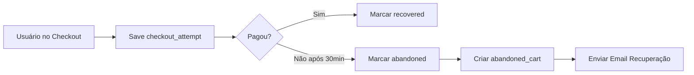

# 🔍 DIAGNÓSTICO: Dados Faltantes no Dashboard

## ❌ PROBLEMAS IDENTIFICADOS

### 1. **Mercado Pago - Tentativas Não Registradas**

**Problema:**
- Dashboard não mostra tentativas de pagamento do Mercado Pago
- Só aparecem vendas **PAGAS**, não aparecem tentativas **RECUSADAS** ou **PENDENTES**
- Cliente que tentou mas não completou: **INVISÍVEL**

**Causa Raiz:**
```typescript
// ❌ PROBLEMA: app/api/checkout/enterprise/route.ts
// Só salva em payment_attempts quando tem SUCESSO
if (mpResult.status === 'approved') {
  await supabaseAdmin.from('payment_attempts').insert({...})
}
// ❌ Se recusado, NÃO SALVA NADA!
```

**Solução:**
Salvar **TODAS** as tentativas, mesmo recusadas:
```typescript
// ✅ CORRETO: Salvar antes de verificar sucesso
await supabaseAdmin.from('payment_attempts').insert({
  sale_id: order.id,
  provider: 'mercadopago',
  status: mpResult.status, // approved, rejected, pending, etc
  rejection_code: mpResult.status_detail,
  raw_response: mpResult
})
```

---

### 2. **Carrinhos Abandonados - Não Sincronizam**

**Problema:**
- Tabela `abandoned_carts` existe
- Código não está criando registros automaticamente
- Falta trigger/função para detectar abandono

**Causa Raiz:**
```sql
-- Tabela existe mas não há lógica para popular
CREATE TABLE abandoned_carts (...)
-- ❌ Nenhum INSERT automático acontece!
```

**Solução:**
1. **Frontend**: Salvar checkout_attempt quando usuário inicia checkout
2. **Cron Job**: Marcar como abandonado após 30 minutos sem compra
3. **Webhook**: Remover de abandonados quando pagar

---

### 3. **AppMax - Sincronização Manual**

**Problema:**
- Vendas do painel AppMax não aparecem no dashboard
- Não há sincronização automática
- API AppMax não envia webhooks confiáveis

**Causa Raiz:**
- AppMax webhook chega atrasado ou não chega
- Precisa de sincronização pull (buscar do painel deles)

**Solução:**
1. **Cron Job Diário**: Buscar vendas dos últimos 7 dias da API AppMax
2. **API Endpoint**: `/api/admin/sync-appmax` (botão manual)
3. **Comparar por email**: Evitar duplicatas

---

## 🎯 PLANO DE CORREÇÃO

### FASE 1: Registrar Tentativas do Mercado Pago (15 min)

**Arquivos a modificar:**
1. `app/api/checkout/enterprise/route.ts`
2. `app/api/checkout/process/route.ts`

**O que fazer:**
- Mover `payment_attempts.insert()` para ANTES do `if (status === 'approved')`
- Registrar status real: `rejected`, `pending`, `in_process`
- Salvar `rejection_code` para análise (ex: `cc_rejected_insufficient_funds`)

---

### FASE 2: Implementar Carrinhos Abandonados (30 min)

**Fluxo:**


**Implementação:**
1. **Salvar tentativa**: Quando usuário clica em "Finalizar Compra"
2. **Cron Supabase**: Rodar a cada 15 minutos
3. **Verificar**: `checkout_attempts` sem `sale_id` e > 30min
4. **Inserir**: Em `abandoned_carts` com link de recuperação

---

### FASE 3: Sincronização AppMax (45 min)

**API AppMax:**
```bash
# Endpoint que precisamos usar
GET https://app.appmax.com.br/api/order_list
Headers:
  token-key: SEU_TOKEN_APPMAX
  user-code: SEU_USER_CODE
  
Query Params:
  ?start_date=2026-01-20
  &end_date=2026-01-27
  &status=paid
```

**Implementação:**
1. Criar `lib/appmax-sync.ts` com função de sincronização
2. Criar `app/api/admin/sync-appmax/route.ts`
3. Adicionar botão no dashboard admin
4. Comparar por `customer_email` para evitar duplicatas

---

## 📊 ESTRUTURA DE DADOS ATUAL

### Tabela: `sales`
```sql
- id (UUID)
- customer_email (TEXT)
- order_status (TEXT) -- paid, failed, pending, processing
- payment_gateway (TEXT) -- mercadopago, appmax
- mercadopago_payment_id (TEXT)
- total_amount (NUMERIC)
- created_at (TIMESTAMPTZ)
```

### Tabela: `payment_attempts`
```sql
- id (UUID)
- sale_id (UUID) -- FK para sales
- provider (TEXT) -- mercadopago, appmax
- status (TEXT) -- approved, rejected, pending
- rejection_code (TEXT) -- cc_rejected_high_risk
- raw_response (JSONB)
- created_at (TIMESTAMPTZ)
```

### Tabela: `checkout_attempts`
```sql
- id (UUID)
- customer_email (TEXT)
- customer_name (TEXT)
- total_amount (NUMERIC)
- payment_method (TEXT)
- sale_id (UUID) -- NULL se não completou
- created_at (TIMESTAMPTZ)
```

### Tabela: `abandoned_carts`
```sql
- id (UUID)
- customer_email (TEXT)
- customer_name (TEXT)
- items (JSONB)
- total_amount (NUMERIC)
- status (TEXT) -- abandoned, recovered
- recovery_link (TEXT)
- created_at (TIMESTAMPTZ)
```

---

## 🧪 COMO TESTAR

### Teste 1: Tentativa Recusada MP
```bash
# 1. Fazer checkout com cartão teste RECUSADO
# Cartão: 5031 4332 1540 6351
# CVV: 123
# Validade: 11/25

# 2. Verificar no Supabase:
SELECT * FROM payment_attempts 
WHERE status = 'rejected' 
ORDER BY created_at DESC LIMIT 5;

# 3. Deve aparecer no dashboard admin > Pagamentos > Mercado Pago
```

### Teste 2: Carrinho Abandonado
```bash
# 1. Ir no checkout
# 2. Preencher dados
# 3. NÃO finalizar (fechar aba)
# 4. Aguardar 30 minutos
# 5. Verificar:
SELECT * FROM abandoned_carts 
WHERE status = 'abandoned' 
ORDER BY created_at DESC;
```

### Teste 3: Sincronização AppMax
```bash
# 1. Clicar no botão "Sincronizar AppMax"
# 2. Ver log no console
# 3. Verificar vendas importadas:
SELECT * FROM sales 
WHERE payment_gateway = 'appmax' 
AND created_at > NOW() - INTERVAL '24 hours';
```

---

## 🔧 API AppMax - Como Testar

### 1. Obter Credenciais
```
Dashboard AppMax > Configurações > Integrações > API
- TOKEN_KEY: eyJhbGci...
- USER_CODE: 12345
```

### 2. Testar Endpoint
```bash
# Listar vendas dos últimos 7 dias
curl -X GET "https://app.appmax.com.br/api/order_list?start_date=2026-01-20&end_date=2026-01-27&status=paid" \
  -H "token-key: SEU_TOKEN_APPMAX" \
  -H "user-code: SEU_USER_CODE"

# Resposta esperada:
{
  "success": true,
  "data": [
    {
      "id": 123456,
      "customer_email": "cliente@example.com",
      "amount": 497.00,
      "status": "paid",
      "created_at": "2026-01-25T10:30:00Z"
    }
  ]
}
```

### 3. Verificar Campos Retornados
```json
{
  "id": 123456,                    // ID AppMax (guardar em appmax_order_id)
  "customer_name": "João Silva",
  "customer_email": "joao@example.com",
  "customer_phone": "21999999999",
  "customer_cpf": "12345678900",
  "amount": 497.00,
  "status": "paid",               // paid, pending, refunded, cancelled
  "payment_method": "credit_card", // credit_card, boleto, pix
  "created_at": "2026-01-25T10:30:00Z",
  "paid_at": "2026-01-25T10:32:15Z"
}
```

---

## 📋 CHECKLIST DE IMPLEMENTAÇÃO

### ✅ Prioridade ALTA (Fazer Agora)
- [ ] Registrar tentativas recusadas do Mercado Pago
- [ ] Testar com cartão recusado
- [ ] Verificar dados no dashboard
- [ ] Executar SQLs pendentes no Supabase:
  - [ ] `database/fix-mercadopago-analytics.sql`
  - [ ] `database/fix-include-pending-sales.sql`

### 🔶 Prioridade MÉDIA (Esta Semana)
- [ ] Implementar sistema de carrinhos abandonados
- [ ] Criar cron job para detectar abandonos
- [ ] Email de recuperação
- [ ] Testar fluxo completo

### 🔷 Prioridade BAIXA (Próxima Semana)
- [ ] Sincronização AppMax automática
- [ ] Botão manual no dashboard
- [ ] Deduplicação por email
- [ ] Log de sincronizações

---

## 🚀 PRÓXIMO PASSO IMEDIATO

1. **EXECUTAR OS SQLs NO SUPABASE** (você precisa fazer isso):
   - `fix-mercadopago-analytics.sql`
   - `fix-include-pending-sales.sql`

2. **CORRIGIR REGISTRO DE TENTATIVAS** (eu vou fazer agora):
   - Modificar `app/api/checkout/enterprise/route.ts`
   - Registrar TODAS as tentativas, não só as aprovadas

3. **TESTAR COM CARTÃO RECUSADO**:
   - Usar cartão teste: `5031 4332 1540 6351`
   - Verificar se aparece no dashboard

---

## 📞 DOCUMENTAÇÃO AppMax

- **Base URL**: `https://app.appmax.com.br/api/`
- **Autenticação**: Headers `token-key` e `user-code`
- **Endpoints**:
  - `GET /order_list` - Lista pedidos
  - `GET /order/{id}` - Detalhes de um pedido
  - `POST /order/refund` - Estornar pedido

**Documentação oficial**: https://docs.appmax.com.br/api/orders

---

## ⚠️ ATENÇÃO

**Sem executar os SQLs, o dashboard continuará quebrado!**

Os arquivos SQL criam:
- Views para agregar dados MP + AppMax
- Funções RPC para métricas
- Índices para performance

**É OBRIGATÓRIO executá-los antes de usar o dashboard.**
